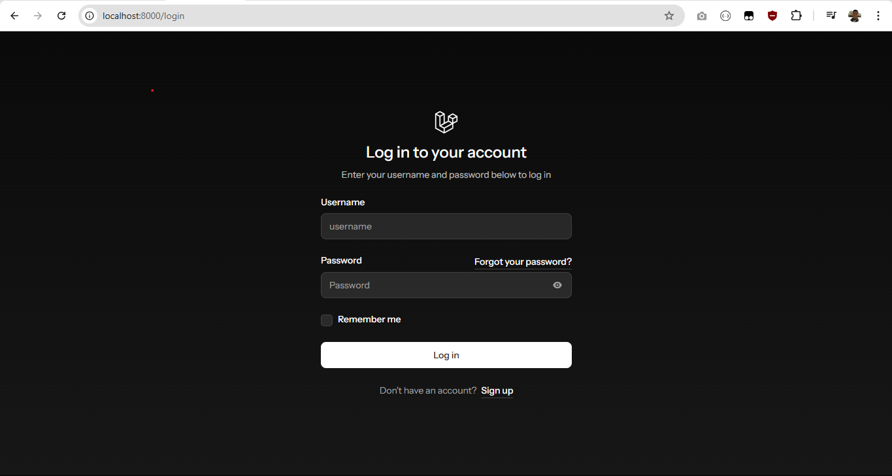
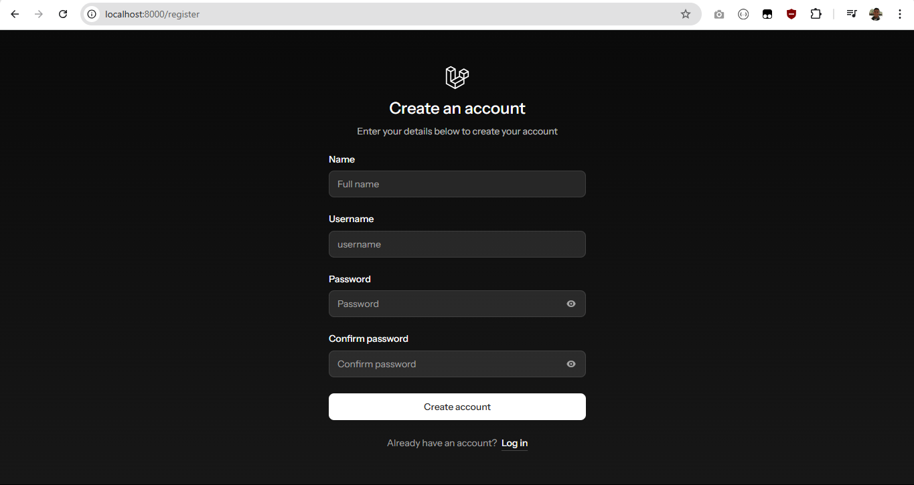
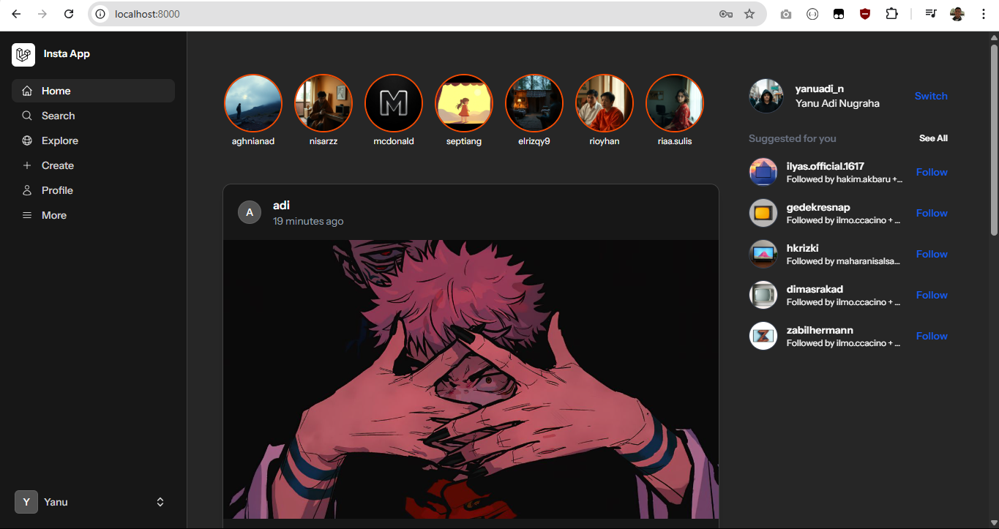
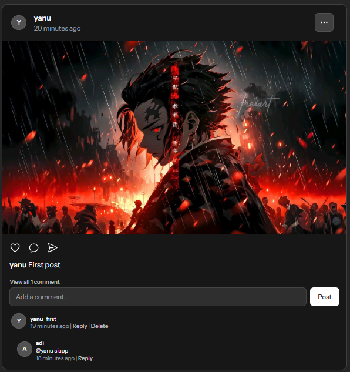
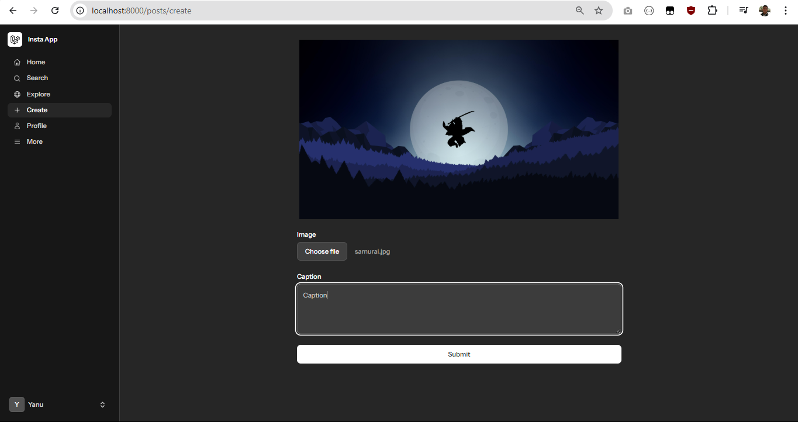

# 📸 InstaApp

InstaApp is a web-based social media application inspired by Instagram. Built with **Laravel**, **Livewire**, and **PostgreSQL**, it allows users to register, upload photos, follow others, like posts, and comment — all in real-time without page reloads.

## 🔧 Tech Stack

- ⚙️ **Backend**: Laravel 10+
- ⚡ **Frontend**: Livewire
- 🐘 **Database**: PostgreSQL
- 🎨 **Styling**: Tailwind CSS

---

## ✨ Features

- User registration & authentication
- Upload posts with captions and images
- Real-time likes and comments with Livewire

---

## 📸 Screenshots

1. Login Area


2. Register


3. Home 1


4. Home 2


5. Create Post


---

## 🚀 Getting Started

### Prerequisites

- PHP 8.1+
- Composer
- Node.js & npm
- PostgreSQL

### Installation

```bash
# Clone the repo
git clone https://github.com/yanuadin/tech-test-insta-app-sevima.git insta-app
cd insta-app

# Install PHP dependencies
composer install

# Install JS dependencies
npm install && npm run dev

# Create your environment file
cp .env.example .env

# Set your database credentials in .env
DB_CONNECTION=pgsql
DB_HOST=127.0.0.1
DB_PORT=5432
DB_DATABASE=your_database
DB_USERNAME=your_postgres_user
DB_PASSWORD=your_password

# Generate app key
php artisan key:generate

# Run migrations and seeders
php artisan migrate --seed

# Serve the application
composer run dev
